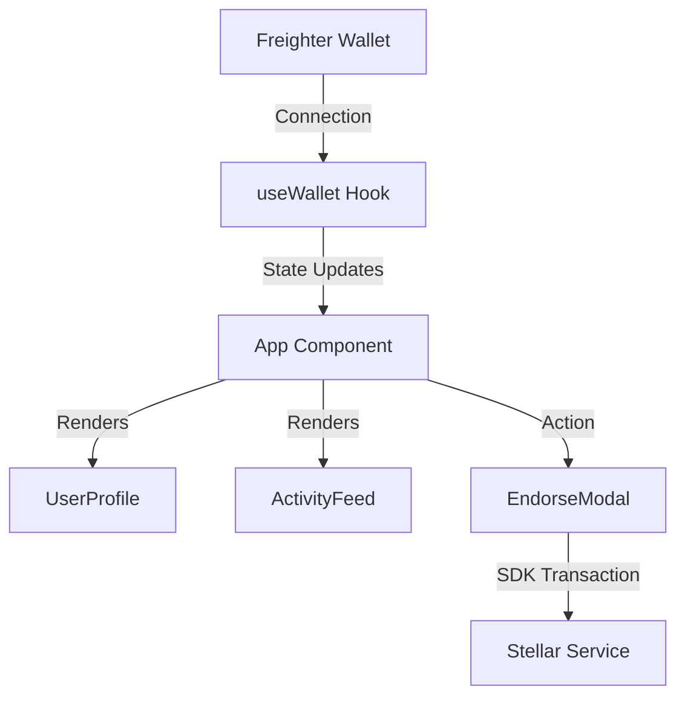

# Trustify — System Architecture

This document provides a comprehensive overview of the architecture of the Trustify application, mapping out the frontend components, services, and how the state interacts with the Stellar blockchain.

## 🏗️ Feature-Based Architecture

Trustify utilizes a scalable, domain-driven structure (Feature-Based Architecture). Instead of a flat hierarchy, the code is organized around business features.

### Directory Mapping
```
src/
├── components/          # Shared, global UI & Layout
│   ├── layout/          # Header, generic page wrappers
│   └── ui/              # Atom-level pieces (Spinners, Progress bars)
├── features/            # Feature-specific scopes
│   ├── trust/           # Trust features (Reputation logic, tasks modal)
│   │   ├── components/  # TaskCard, CreateTaskModal, UserProfile
│   │   └── hooks/       # useTrustSystem
│   └── wallet/          # Wallet integration logic
│       ├── components/  # WalletConnect Button
│       └── hooks/       # useWallet (Freighter communication)
├── services/            # Blockchain network logic
│   └── stellar.service.ts
└── types/               # TypeScript models
```

---

## 🔗 Stellar Blockchain Connection

The architecture separates direct interaction logic with the blockchain into the **Services** tier.

- **`stellar.service.ts`**: Holds operations for checking Soroban smart contract instances, paying XLM fees, and validating Freighter wallets.

---

## ⚡ State & Event Flow



1. The client utilizes the **`useWallet` hook** to establish validation.
2. Changes fire into top-level states mapping metrics via the **`useTrustSystem`**.
3. All operations generate testnet-scoped verification entries.

## 🛠️ Modularity and Reusability
- Layout components are optimized for minimal re-renders.
- Components in the `ui` folder adapt via robust interfaces.
